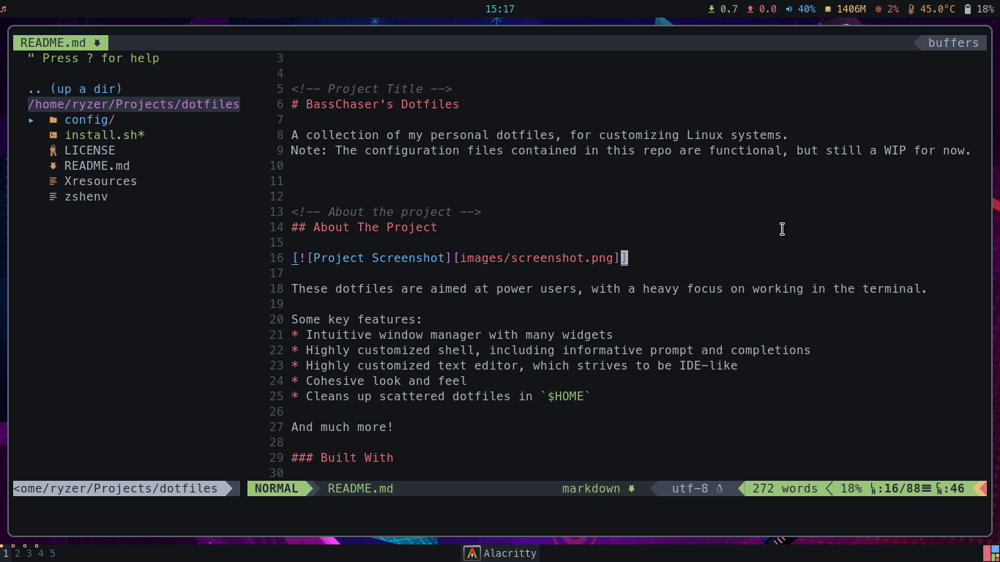

# Dotfiles

A collection of my personal dotfiles for customizing *nix systems.

## About



These dotfiles are aimed at power users, with a strong focus on working in the terminal.

**Some key features:**

- Intuitive, informative, keyboard-driven window manager environment.
- Highly customized CLI shell, with informative prompt and completions.
- Highly customized text editor (Neovim), which strives to be IDE-like.
- Cohesive look and feel. All elements use the same or similar color scheme.
- Configurations for both Wayland, and X11 (deprecated).
- Cleans up many of the scattered dotfiles in `$HOME`.

This repository is managed by [YADM (Yet Another Dotfiles Manager)](https://yadm.io),
 a Git wrapper for managing dotfiles.

## Installation

### Manually (using Git)

1. Clone this repository.

   ```sh
   git clone https://github.com/ralgar/dotfiles.git
   ```

2. Manually install any dotfiles you want. If you use my Git config, please be
   sure to change the identity.

### Automatically (using YADM)

**WARNING:** This option is destructive, and is primarily intended for my
 personal use on Arch Linux. Running the bootstrap program requires root
 privileges, and will make a variety of system modifications including
 (but not limited to) installing packages, and editing configuration files.
 Use at your own risk!

1. Clone this repository with YADM.

   ```sh
   yadm clone https://github.com/ralgar/dotfiles.git
   ```

2. When asked if you want to run the bootstrap program, choose yes, and follow
   the prompts.

## License

Distributed under the GNU GPL-2.0 License. See `.github/LICENSE`, or the
 sidebar, for more info.

## Acknowledgements

Thanks to these amazing projects, which are used in these dotfiles:

* [Powerlevel10k](https://github.com/romkatv/powerlevel10k) - The incredible
  Zsh prompt.
* [Lain](https://github.com/lcpz/lain) - The code from which I hacked up the
  AwesomeWM widgets.
